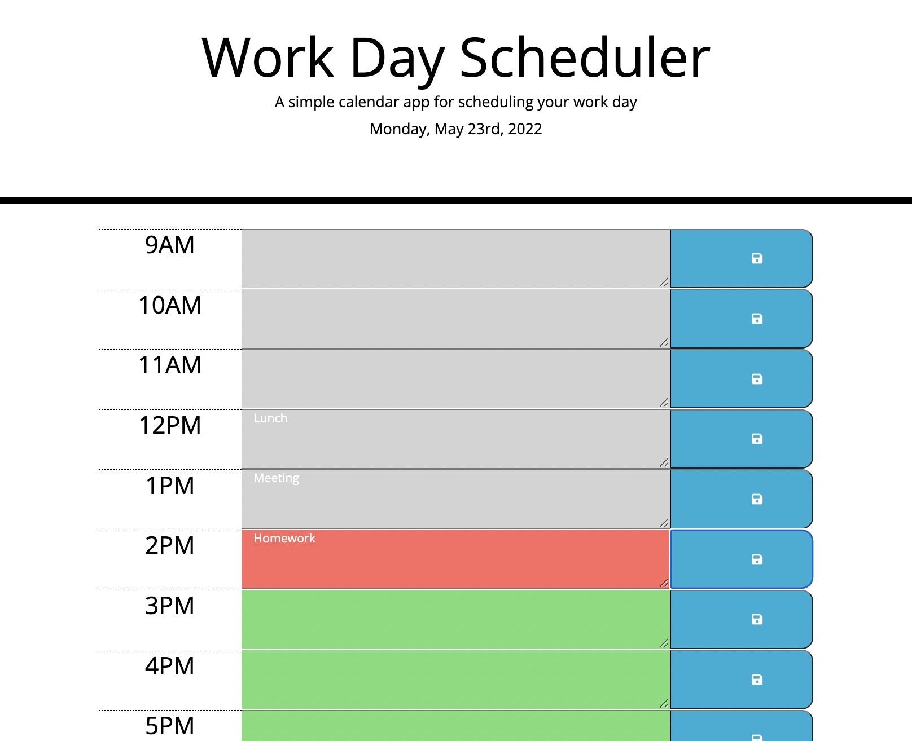
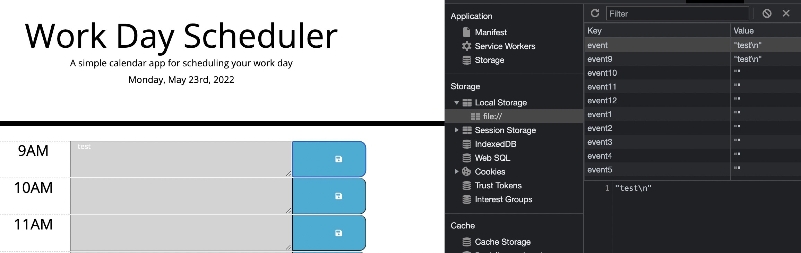

# workday-scheduler-challenge

## Purpose
To build a workday scheduler that displays the current date, saves user's event input, and color codes the hours to represent past, present, and future.

## Built With
* HTML
* JavaScript
* CSS
* JQuery
* Moment JS

## Website
https://cdonais.github.io/workday-scheduler-challenge/

## Screenshot

